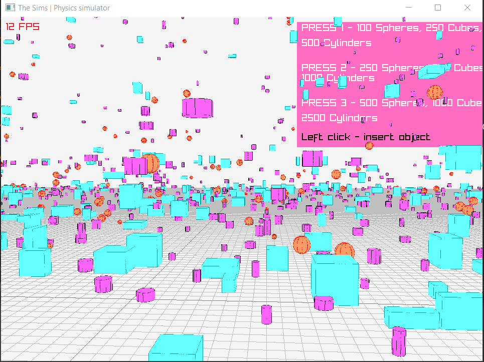

# The Sims - Real-Time 3D Physics Simulator
A real time physics simulator by using raylib library and compute shaders

## Showcase

## Scenarios
1. Lightweight scenario

    * 100 spheres

    * 250 cubes

    * 500 cylinders/cones

2. Medium scenario

    * 250 spheres

    * 500 cubes

    * 1000 cylinders/cones

3. Heavyweight scenario

    * 500 spheres

    * 1000 cubes

    * 2500 cylinders/cones

